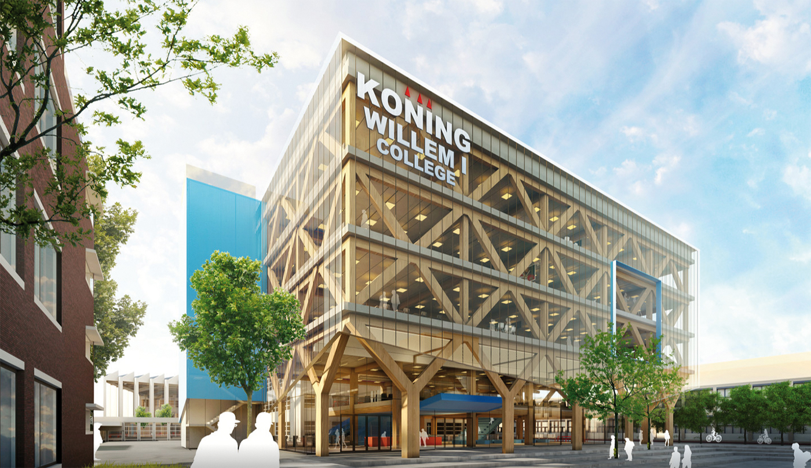
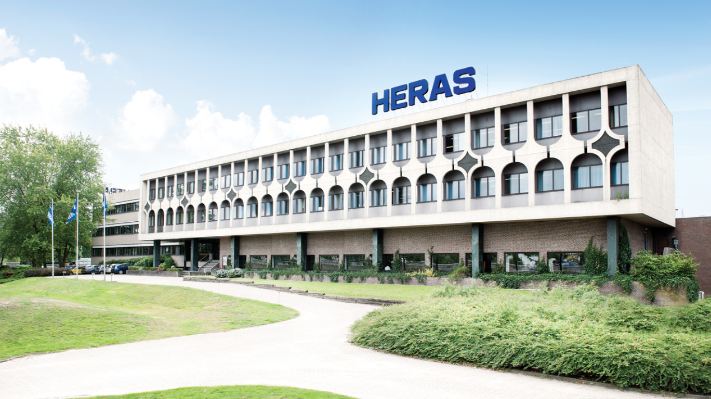

# Education

## Software Developer - Koning Willem I College
This is the course that I'm currently following. I'm in my third and final year, preparing for my final exams. The course focusses on making you an all-round software developer, teaching you a diverse set of [skills]() like: HTML / CSS, Javascript, PHP, .NET / C# and SQL. Besides the coding languages we learn to work with widely used software and systems like VMware and DevOps. During the course we also go on [internships]() to learn more about how it is to be in the actual workplace.

## Student Council - Koning Willem I College
During my studies I also decided to sign up for the student council. The student council has weekly discussions about new policies, organising activities and improving the students' life within the school, along with many other subjects. We don't just sit there and discuss however, we organise seasonal activities and make sure the new policies actually get added in the school.

After a merge with another school, a lot of the student council got revamped and I became the head of the *inlcusivity and sustainability* commission. The commission has the task to make sure all students feel welcome and comfortable within the school and make sure the school continues it's path to becoming a green and sustainable school. We do this by helping organise activities representing minority groups of people and implementing new green ideas on campus.

In a way, I learned just as much from the student council as I did from my studies in school. Not in terms of building software, but by introducing me to how everything runs within a big organisation and how to get stuff done by taking the right actions.

## VMBO-T - Kempenhorst College
This was my middle / high school education. It wasn't anything special, I learned the basic set of skills any student learns. This was the time however, where I discovered my interest for building software. I also opted in for the optional [Anglia English]() to become better at the English Language.

# Internships

## Heras

During the first half in my second year I interned at Heras. Heras is an *international* protection company. That means that they come up with and make solutions across many different sectors. They're widely known for their security solutions which includes fences, gates, cameras and other solutions.
